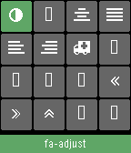

Font Awesome Viewer for Pebble Time
====

A very simple [Font Awesome](http://fortawesome.github.io/Font-Awesome/) icon viewer for Pebble Time. It displays a grid with all the 519 icons present on version 4.3.

To navigate the grid use the up and down buttons of the device. Click to move between items and long click to move between pages.

Note: Some of the icons are not displayed. No idea why, but probably related with limited unicode support on Pebble.

How to install
----

* Install [Pebble SDK 3](http://developer.getpebble.com/sdk/download/)
* Install [Bower](http://bower.io)
* Clone this repository
* ``bower install && npm install``
* ``grunt run`` to compile and run on the Basalt emulator
* Use the ``pebble`` command line to install on your phone
